# User guide

Everything Probe Site Doctor does starts from one read-only scan. Nothing on this
tour changes your site.

- [Install and first scan](#install-and-first-scan)
- [Dashboard](#dashboard)
- [Findings](#findings)
- [Website Health Report](#website-health-report)
- [Page Speed](#page-speed)
- [Core Web Vitals from real visitors](#core-web-vitals-from-real-visitors)
- [Developer](#developer)
- [Scan History](#scan-history)
- [Who can see what](#who-can-see-what)

## Install and first scan

1. Upload the `probe-site-doctor` folder to `wp-content/plugins/`, or install the zip from **Plugins → Add New → Upload Plugin**.
2. Activate it. A new **Site Doctor** menu appears.
3. Open **Site Doctor → Dashboard** and click **Run health scan**.

The scan runs one check per request with a progress bar, so it does not hit PHP
time limits on slow hosts. Without JavaScript it falls back to a single request.
Only one scan runs at a time.

## Dashboard

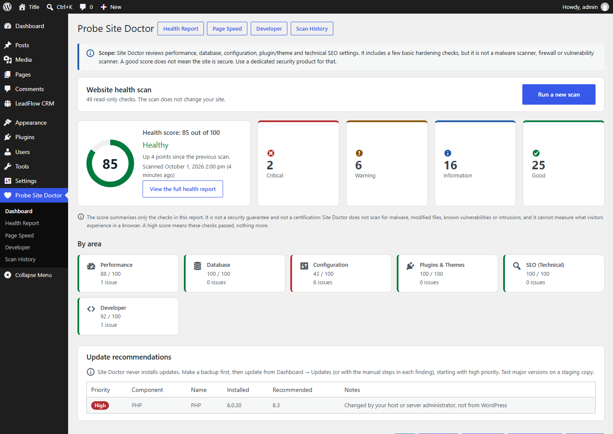

- **Health score** (0–100) with the band: Healthy, Needs attention, Needs urgent attention, plus the change since the previous scan.
- **Severity counts**: Critical, Warning, Information, Good.
- **By area**: a score and issue count per category — Performance, Database, Configuration, Plugins & Themes, SEO (Technical), Developer.
- **Update recommendations**: WordPress, plugins, themes and PHP, prioritised. Site Doctor never installs anything.

The sentence under the score is deliberate: the score summarises the checks in
this report and is **not a security guarantee**.

## Findings

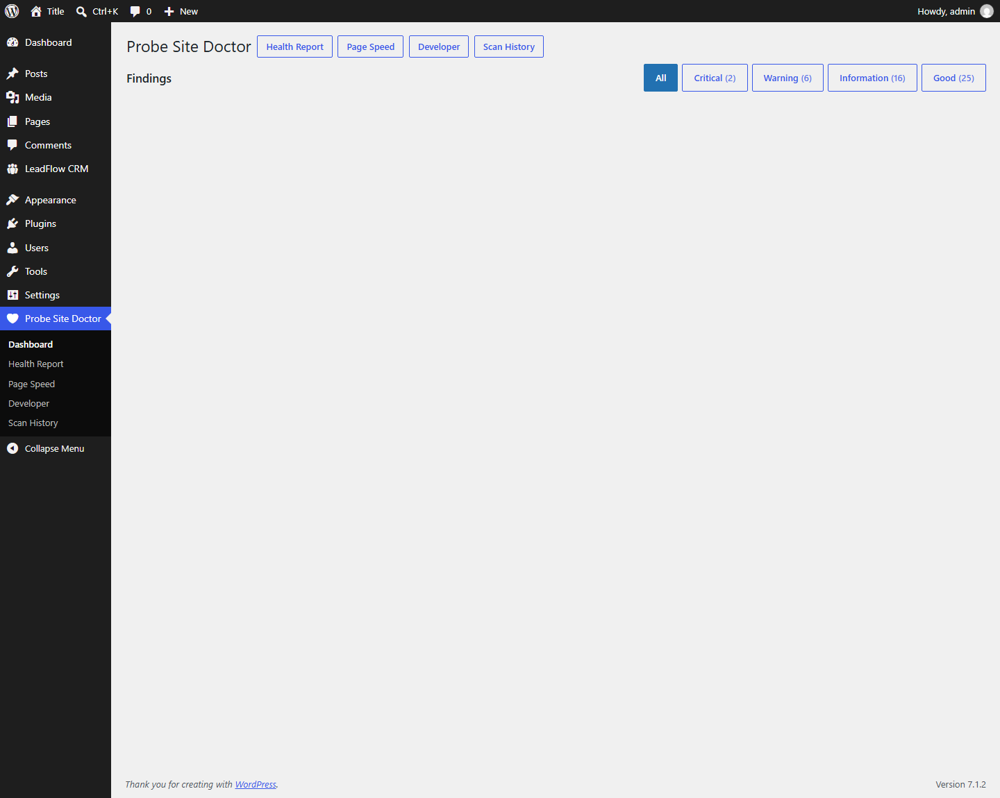

Every finding reads the same way:

| Part | What it tells you |
|---|---|
| **Severity** | Good, Information, Warning or Critical |
| **Finding** | The headline: what was found |
| **Explanation** | What was measured, and what it means |
| **Estimated impact** | Low, Medium or High, with why |
| **Recommended action** | What to do about it |
| **Manual instructions** | Optional collapsible steps and copyable commands — for cleanup, updates, configuration changes or content fixes |

Site Doctor never runs those instructions for you. Database cleanup is never
automatic; see [CLEANUP-POLICY.md](CLEANUP-POLICY.md).

Each finding also carries a **measurement badge**: *Server-side* (settings,
files, database) or *Server loopback* (the server requested one of its own
public URLs). Neither is a browser measurement.

## Website Health Report

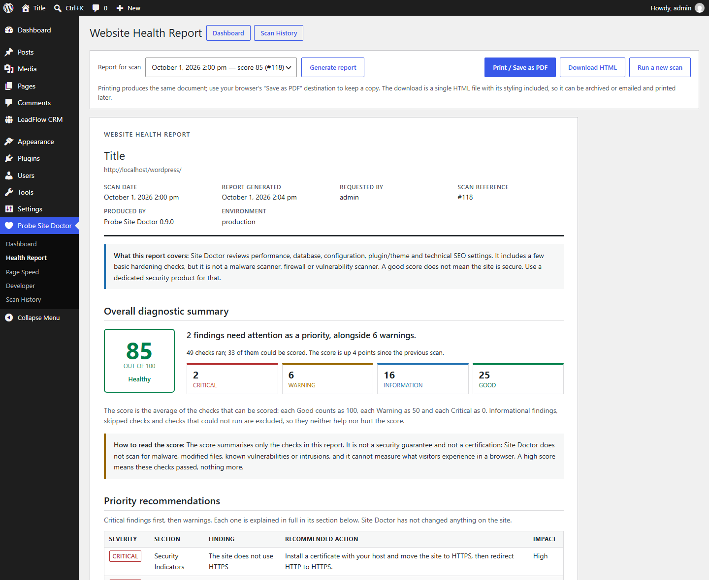

**Site Doctor → Health Report** turns any completed scan into a document you can
read, print or hand to a client:

1. Header — site, URLs, scan and generation dates, who requested it, scan reference, plugin version, environment.
2. Overall diagnostic summary — score, verdict, counts, how the score is calculated and what it does not mean.
3. Priority recommendations — critical first, then warnings.
4. Section summaries.
5. Seven sections — Performance, Database, Plugins & Themes, Configuration, Security Indicators, SEO (Technical), Developer — each repeating its own scope, then its findings.
6. Environment at scan time.

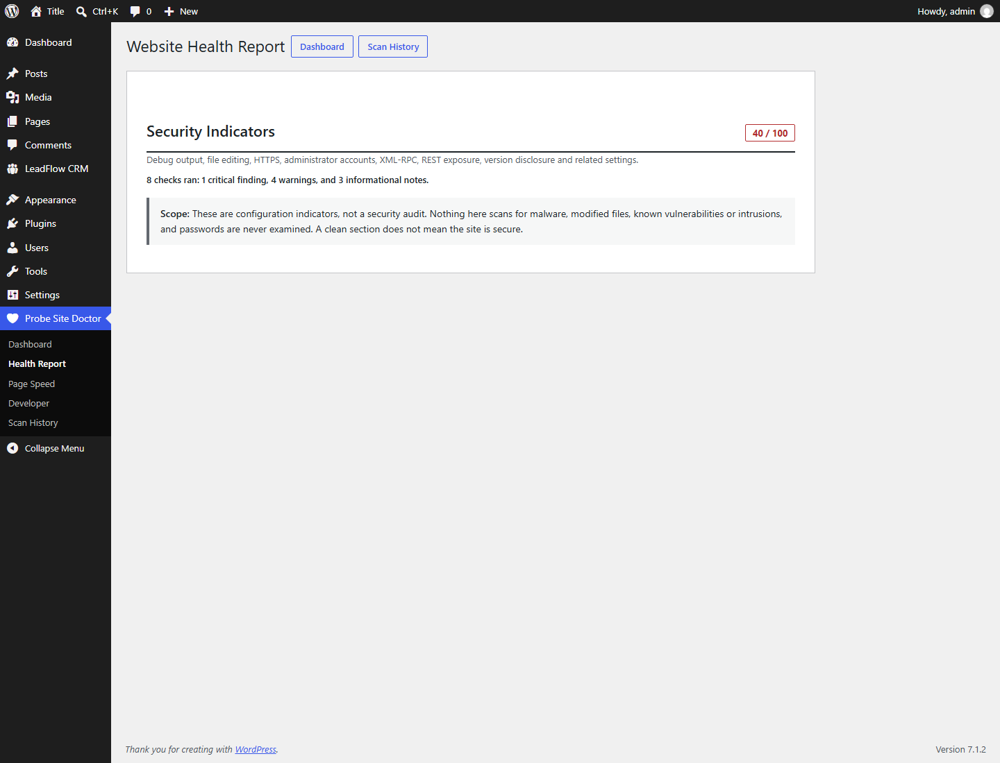

- **Print / Save as PDF** prints the same document; each section starts on a new page and the admin chrome is excluded.
- **Download HTML** gives you one self-contained file (styling inline, no external references) to archive or email.
- Any stored scan can be selected from the picker, and **Scan History** offers *Printable report* and *Download* per row.

## Page Speed

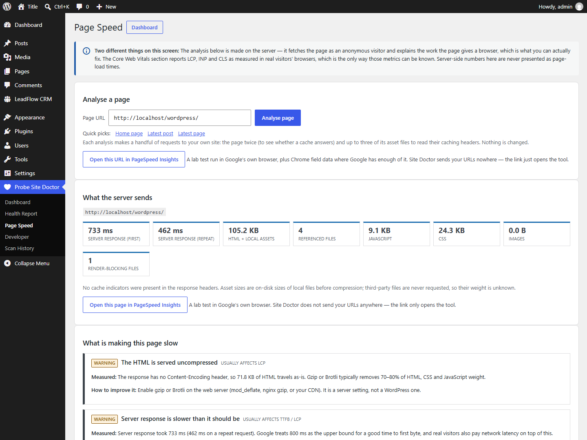

Pick a page — home, blog index, latest post/page/product, or any URL on this
site — and Site Doctor fetches it as an anonymous visitor, twice (to see whether
a cache answers), plus up to three of its asset files to read caching headers.

**What the server sends**: first and repeat response time, cache indicators,
HTML and local asset weight, file counts, render-blocking files.

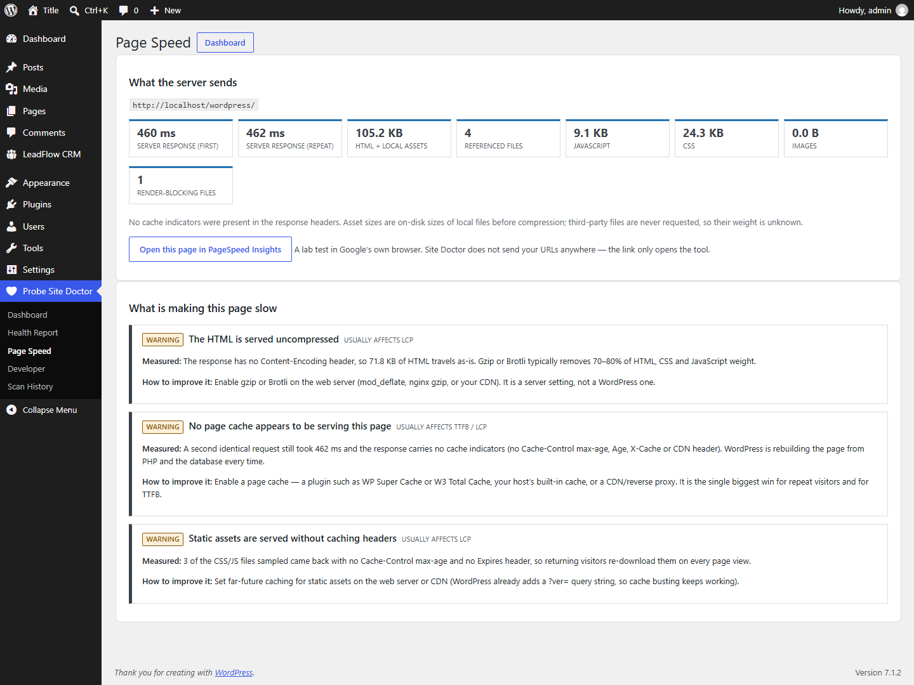

**What is making this page slow**: a prioritised list. Each cause states what was
measured, which Core Web Vital it usually affects, and how to improve it.

Limits, stated on the screen: sizes are on-disk sizes before compression,
third-party files are never requested, and assets injected later by JavaScript
are invisible to a server-side fetch. For a lab audit, the screen links the page
to PageSpeed Insights — Site Doctor sends your URLs nowhere.

## Core Web Vitals from real visitors

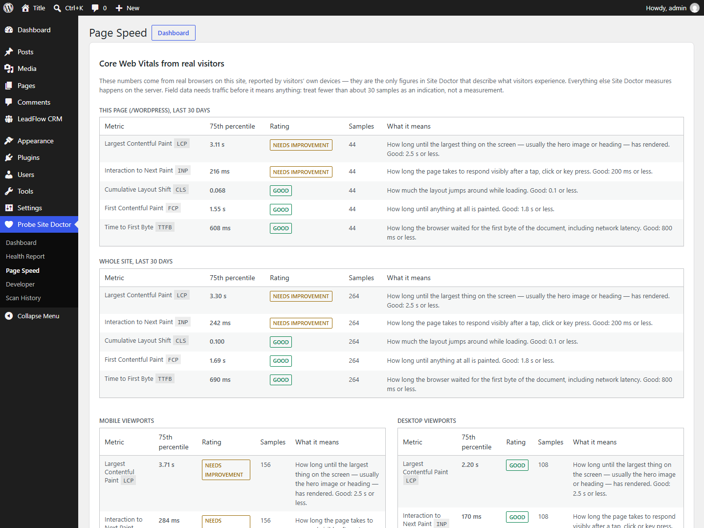

This is the only part of Site Doctor that measures what visitors experience,
because it is the only part that runs in their browsers. **It is off by
default.**

When an administrator enables it, a small first-party script on public pages
reports LCP, INP, CLS, FCP and TTFB back to your own site. The screen shows the
75th percentile for the analysed page, for the whole site, and split by mobile
and desktop viewports, rated against Google's thresholds.

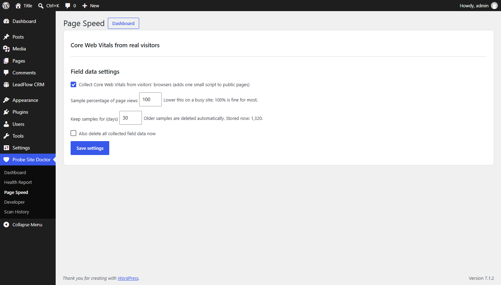

Settings (require `manage_options`): enable/disable, sampling percentage,
retention in days, and *delete all collected field data*. See
[PRIVACY.md](PRIVACY.md) for exactly what is and is not stored.

## Developer

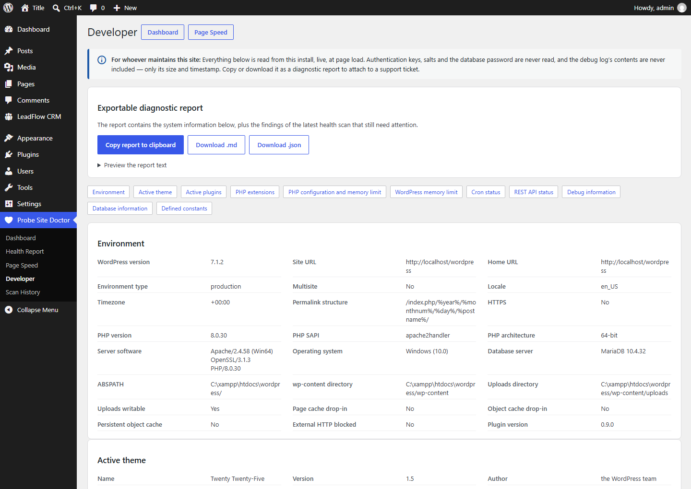

The screen to open when you inherit someone else's install: environment, active
theme, active plugins (with must-use plugins and drop-ins), PHP extensions, PHP
configuration and memory limit, WordPress memory limits, cron status, REST API
status, debug information, database information and whitelisted constants.

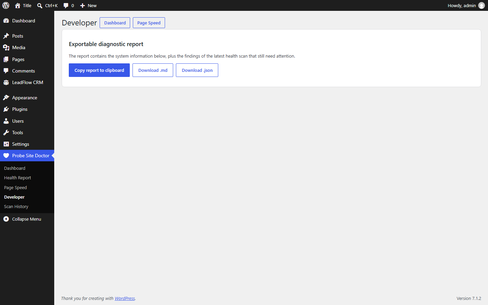

**Exportable diagnostic report** — copy to clipboard, download `.md` or `.json`.
It includes the system information plus the findings of the latest scan that
still need attention, so it can be pasted straight into a support ticket.

Never included: authentication keys, salts, the database password, and the
contents of the debug log (only its size and timestamp).

## Scan History

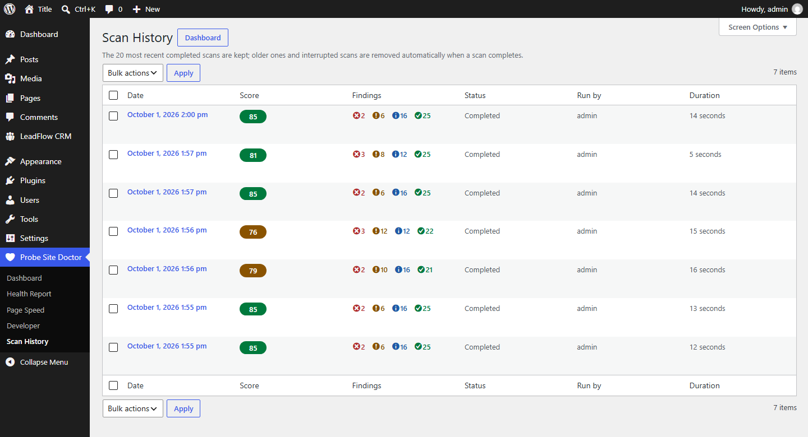

Stored scans with score, counts, source and duration. Open, print, download or
delete any of them. Retention keeps the newest 20 completed scans by default
(filter `probesd_scan_retention`); abandoned scans are pruned automatically.

## Who can see what

| Capability | Grants | Default |
|---|---|---|
| `probesd_view_reports` | Dashboard, history, reports, Page Speed, Developer, exports | Administrator |
| `probesd_run_scans` | Start scans, delete reports | Administrator |
| `probesd_run_cleanup` | Confirm future cleanup operations (none exist yet) | Administrator |
| `manage_options` | Field-data settings, because they change the public site | Administrator |

Reports reveal server details, so none of these are granted to
non-administrators by default.
